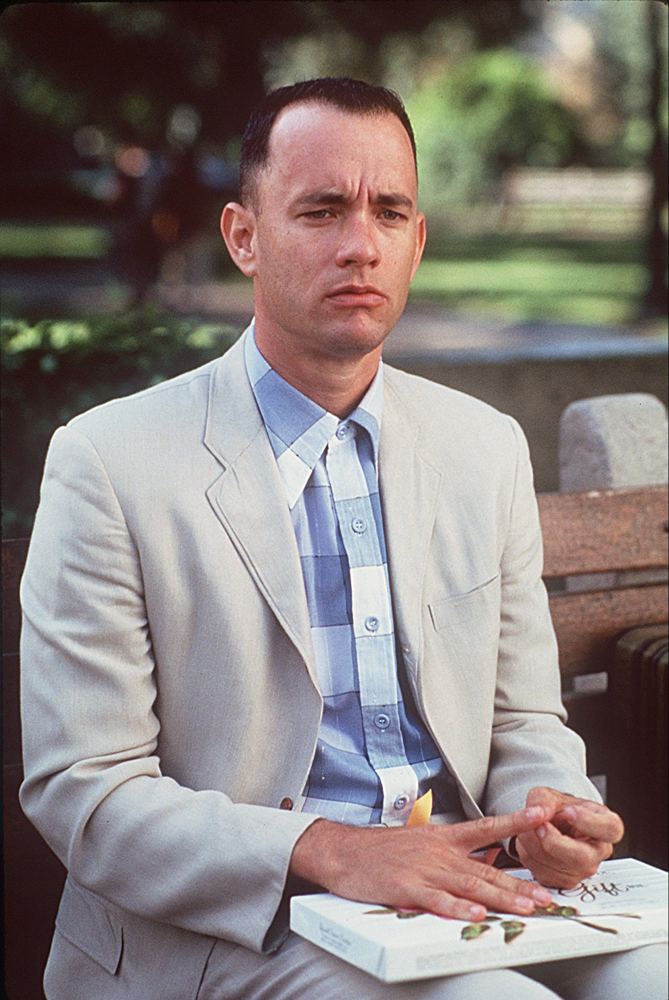

# About Me

Whad hannin'.  
My name is Jonathan like Joe-Nathan, but you can call me Jon.  
Some things about me.  
I'm a former burger engineer turned actual computer engineer.   
I find too many things in life so fascinating.  
I love alliterations, architecture, and rom coms.  
Clever and unique phrases that nobody says ever, probably.  
Owned with a capital P.  
Reddit stories, true or not, but real ones...they da real ones.  
Traffic karaoke singing.  
Dancing my pants off, but not actually.  
Tom Hanks. All my favorite movies have him in it coincidentally.  
Forrest Gump FOR LIFE, but Saving Priving Ryan is super duper good, too.  
AND TERMINAL. CATCH ME IF YOU CAN, TOO.  
I love that guy so much, here's a picture of him that I low key resonate with.  

I could find one thing about anything fascinating honestly.  
Anyways.  
Here's some things I'm truly grateful to be able to experience in life.  
SF Giants games, traveling, snowboarding, festivals, conventions,  
anime, running, hiking, weight lifting, valorant, conversations with you, and Batman.   
